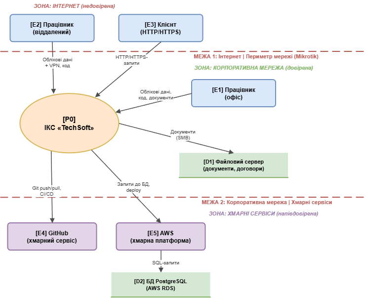

# Звіт з практичної роботи №1

---

**Дисципліна:** Технології створення та застосування систем захисту ІКС

**Практична робота №1:** Моделювання загроз для ІКС

**Виконав:** студент групи КБ-21м Іванов І.І.

**Дата:** 18.02.2026

---

## Мета роботи

Навчитися виявляти загрози інформаційно-комунікаційної системи (ІКС) за допомогою методології STRIDE: побудувати діаграму потоків даних (DFD Level 0), ідентифікувати загрози за шістьма категоріями STRIDE, описати модель порушника та запропонувати контрзаходи для найсерйозніших загроз.

## 1. Короткий опис організації

ТОВ «TechSoft» -- невелика IT-компанія, що займається розробкою програмного забезпечення на замовлення (веб-додатки та хмарні рішення). У компанії працює близько 30 осіб: 18 розробників, 3 DevOps-інженери, 3 менеджери проєктів, 2 QA-інженери, 2 бухгалтери та 2 ІТ-адміністратори. Центральний офіс розташований у Києві, 10 працівників працюють віддалено з різних міст України. Компанія обробляє комерційну таємницю (вихідний код продуктів), персональні дані працівників та клієнтів, а також фінансову документацію. Основні ІТ-системи: корпоративна пошта Google Workspace, Git-репозиторій на GitHub, хмарна інфраструктура AWS (веб-сервери, бази даних PostgreSQL), файловий сервер та VPN на базі Mikrotik для віддалених працівників.

## 2. DFD-діаграма (Level 0)

**Центральний процес:** [P0] ІКС «TechSoft»

**Зовнішні сутності:**

- [E1] Працівник (офіс) -- розробники, менеджери, бухгалтери в офісі
- [E2] Працівник (віддалений) -- розробники на дистанційній роботі
- [E3] Клієнт -- замовники, що взаємодіють з веб-додатками
- [E4] GitHub -- хмарний сервіс для зберігання коду та CI/CD
- [E5] AWS -- хмарна платформа для веб-додатків та баз даних

**Сховища даних:**

- [D1] Файловий сервер -- внутрішні документи, договори, фінансова звітність
- [D2] БД PostgreSQL (AWS RDS) -- дані клієнтських веб-додатків

**Основні потоки даних:**

| Від | До | Дані |
|---|---|---|
| [E1] Працівник (офіс) | [P0] ІКС | Облікові дані, код (git push), документи |
| [E2] Працівник (віддалений) | [P0] ІКС | Облікові дані + VPN-тунель, код |
| [E3] Клієнт | [P0] ІКС | HTTP/HTTPS-запити, дані форм |
| [P0] ІКС | [E4] GitHub | Git push/pull, CI/CD-артефакти |
| [P0] ІКС | [E5] AWS | Запити до БД, розгортання додатків |
| [P0] ІКС | [D1] Файловий сервер | Документи, звіти (SMB) |
| [P0] ІКС | [D2] PostgreSQL | SQL-запити, дані додатків |

**Межі довіри:**

- **Межа 1:** Інтернет | Периметр мережі (маршрутизатор Mikrotik)
- **Межа 2:** Корпоративна мережа | Хмарні сервіси (GitHub, AWS)

## 3. Таблиця загроз STRIDE

| № | Елемент DFD | Категорія STRIDE | Опис загрози | Серйозність |
|---|---|---|---|---|
| T01 | [P0] ІКС «TechSoft» | Spoofing | Фішинговий лист від імені керівництва для збору облікових даних Google Workspace | Висока |
| T02 | [P0] ІКС «TechSoft» | Spoofing | Brute-force атака на VPN-шлюз для несанкціонованого підключення до корпоративної мережі | Висока |
| T03 | Потік: Клієнт -> [P0] | Tampering | SQL-ін'єкція через веб-форми для зміни/видалення даних у PostgreSQL | Висока |
| T04 | [E4] GitHub | Tampering | Внесення шкідливого коду через компрометований обліковий запис розробника | Висока |
| T05 | Потік: Працівник -> [P0] | Repudiation | Надсилання вихідного коду конкуренту з запереченням факту | Середня |
| T06 | [D2] БД PostgreSQL | Information Disclosure | Витік бази клієнтів через незахищений бекап у AWS S3 | Висока |
| T07 | [D1] Файловий сервер | Information Disclosure | Несанкціонований доступ до фінансових документів через надмірні права | Середня |
| T08 | Потік: Клієнт -> [P0] | Denial of Service | DDoS-атака на публічний веб-додаток компанії | Середня |
| T09 | [D1] Файловий сервер | Denial of Service | Ransomware шифрує файли на сервері після зараження робочої станції | Висока |
| T10 | [P0] ІКС «TechSoft» | Elevation of Privilege | Експлуатація вразливості AD для підвищення прав до Domain Admin | Висока |

**Покриття STRIDE:** Spoofing (T01, T02), Tampering (T03, T04), Repudiation (T05), Information Disclosure (T06, T07), Denial of Service (T08, T09), Elevation of Privilege (T10) -- усі 6 категорій покрито.

## 4. Модель порушника

### Зовнішній порушник (хакер / кіберзлочинна група)

| Характеристика | Опис |
|---|---|
| **Мотивація** | Фінансова вигода (ransomware, продаж даних), замовлення конкурента |
| **Рівень знань** | Середній-високий: відомі вразливості, готові exploit-и, фішингові кампанії |
| **Початковий доступ** | Інтернет: публічний веб-додаток, VPN-шлюз, електронна пошта працівників |
| **Типові сценарії** | Фішинг -> компрометація акаунту -> lateral movement; SQLi у веб-додатку; DDoS; ransomware |

### Внутрішній порушник (працівник компанії)

| Характеристика | Опис |
|---|---|
| **Мотивація** | Помста (звільнення), фінансова вигода, необережність, жертва фішингу |
| **Рівень знань** | Низький-середній: знання внутрішніх систем, штатні засоби доступу |
| **Початковий доступ** | Робоча станція, обліковий запис AD, доступ до Git, Google Workspace, файлового сервера |
| **Типові сценарії** | Копіювання коду перед звільненням; завантаження malware; надсилання документів на особисту пошту |

## 5. Контрзаходи для топ-3 загроз

### T01: Фішингова атака (Висока)

- **Організаційний:** щоквартальне навчання працівників з розпізнавання фішингу та проведення імітованих фішинг-кампаній (GoPhish). Підвищує пильність та знижує ймовірність натискання на шкідливе посилання.
- **Технічний:** впровадження апаратних ключів 2FA (FIDO2/YubiKey) для Google Workspace та GitHub. Навіть при витоку пароля зловмисник не зможе увійти без фізичного ключа.

### T03: SQL-ін'єкція (Висока)

- **Організаційний:** обов'язковий code review кожного pull request з увагою до безпеки та інтеграція SAST-інструменту (Semgrep) у CI/CD. Виявляє вразливий код до потрапляння у продакшн.
- **Технічний:** використання виключно параметризованих запитів (Prepared Statements/ORM) та розгортання WAF (AWS WAF) з правилами OWASP Top 10. Унеможливлює впровадження SQL-коду.

### T09: Ransomware на файловому сервері (Висока)

- **Організаційний:** розробка та регулярне тестування плану реагування на інциденти (playbook для ransomware: ізоляція, відновлення, повідомлення CERT-UA). Зменшує час реагування.
- **Технічний:** резервне копіювання за правилом 3-2-1 із immutable storage (AWS S3 Object Lock). Незмінні бекапи дозволяють відновити дані без сплати викупу.

## 6. Відповіді на контрольні питання

### 1. Що таке DFD і які основні елементи вона містить?

DFD (Data Flow Diagram) -- графічне представлення руху даних між компонентами системи. Основні елементи: процес (обробляє дані), сховище даних (зберігає дані), потік даних (стрілка з підписом -- переміщення даних), зовнішня сутність (джерело/одержувач даних за межами системи), межа довіри (розділяє зони з різним рівнем безпеки). DFD використовується при моделюванні загроз для виявлення точок, де дані можуть бути атаковані.

### 2. Категорії STRIDE

1. **Spoofing** -- підміна ідентичності. Приклад: фішинговий лист від імені CEO.
2. **Tampering** -- зміна даних. Приклад: SQL-ін'єкція через веб-форму.
3. **Repudiation** -- заперечення дій. Приклад: працівник надсилає дані конкуренту і заперечує це.
4. **Information Disclosure** -- витік даних. Приклад: публічний S3 bucket з бекапами БД.
5. **Denial of Service** -- порушення доступності. Приклад: DDoS-атака на веб-сервер.
6. **Elevation of Privilege** -- підвищення прав. Приклад: експлуатація вразливості AD для отримання Domain Admin.

### 3. Межа довіри

Межа довіри (Trust Boundary) -- лінія на DFD, що розділяє зони з різними рівнями довіри. Загрози виникають на межах, тому що при переході даних між зонами змінюється контекст безпеки: дані з недовіреної зони (Інтернет) потрапляють у довірену (корпоративна мережа), і якщо валідація недостатня, можлива атака.

### 4. Зовнішній vs внутрішній порушник

Зовнішній порушник атакує ззовні через публічні сервіси, не маючи початкового доступу. Внутрішній порушник вже має легітимний доступ до ресурсів. Внутрішній порушник потенційно небезпечніший, бо знає архітектуру системи та має доступ до критичних даних, а його дії виглядають легітимно. Однак за частотою атак переважає зовнішній порушник.

### 5. STRIDE та CIA

Tampering -> Integrity (цілісність), Information Disclosure -> Confidentiality (конфіденційність), Denial of Service -> Availability (доступність). STRIDE розширює CIA трьома додатковими властивостями: Spoofing -> автентичність, Repudiation -> неспростовність, Elevation of Privilege -> авторизація.

## Висновки

У ході роботи побудовано контекстну DFD-діаграму (Level 0) для ІКС IT-компанії «TechSoft» з 5 зовнішніми сутностями, 2 сховищами даних та 2 межами довіри. Ідентифіковано 10 загроз за методологією STRIDE з повним покриттям усіх 6 категорій. Описано 2 типи порушників (зовнішній та внутрішній) та запропоновано по 2 контрзаходи для 3 найсерйозніших загроз.

Найнебезпечнішими категоріями STRIDE для IT-компанії є Spoofing (фішинг -- найпоширеніший вектор) та Information Disclosure (витік коду та даних клієнтів загрожує репутаційними збитками). Пріоритетні заходи: впровадження FIDO2-автентифікації, безпечна розробка (параметризовані запити, code review) та надійне резервне копіювання.
