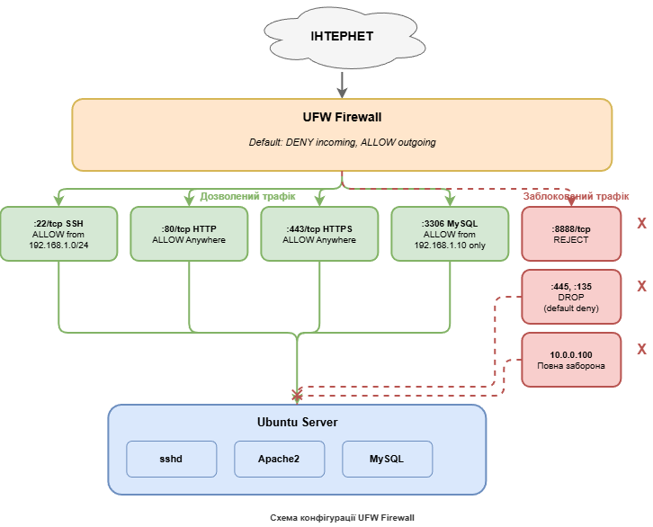

# Звіт з практичної роботи №4

## Міжмережевий екран: налаштування ufw та створення базових правил фільтрації

---

**Дисципліна:** Технології створення та застосування систем захисту ІКС

**Студент:** Іванов І.І.

**Група:** КБ-21м

**Дата виконання:** 18.02.2026

---

## 1. Мета роботи

Зрозуміти принципи роботи міжмережевого екрану та навчитися створювати базові правила фільтрації мережевого трафіку за допомогою ufw (Uncomplicated Firewall): налаштування політик за замовчуванням, дозвіл та блокування з'єднань за портами та IP-адресами, перевірка правил та аналіз логів.

---

## 2. Схема мережі з фаєрволом



---

## 3. Перевірка поточного стану

Перевірка статусу фаєрвола та відкритих портів до початку налаштування:

```
student@ubuntu:~$ sudo ufw status
Status: inactive

student@ubuntu:~$ ss -tlnp
State    Recv-Q   Send-Q   Local Address:Port   Peer Address:Port   Process
LISTEN   0        128      0.0.0.0:22            0.0.0.0:*           users:(("sshd",pid=842,fd=3))
LISTEN   0        511      *:80                  *:*                 users:(("apache2",pid=1205,fd=4))
LISTEN   0        128      [::]:22               [::]:*              users:(("sshd",pid=842,fd=4))
```

На сервері працюють два сервіси: sshd на порту 22 та Apache2 на порту 80. Фаєрвол неактивний.

---

## 4. Конфігурація правил ufw

### 3.1. Політики за замовчуванням та базові правила

```
student@ubuntu:~$ sudo ufw default deny incoming
Default incoming policy changed to 'deny'
(be sure to update your rules accordingly)

student@ubuntu:~$ sudo ufw default allow outgoing
Default outgoing policy changed to 'allow'
(be sure to update your rules accordingly)

student@ubuntu:~$ sudo ufw allow ssh
Rules updated
Rules updated (v6)

student@ubuntu:~$ sudo ufw allow 80/tcp
Rules updated
Rules updated (v6)

student@ubuntu:~$ sudo ufw allow 443/tcp
Rules updated
Rules updated (v6)

student@ubuntu:~$ sudo ufw enable
Command may disrupt existing ssh connections. Proceed with operation (y|n)? y
Firewall is active and enabled on system startup
```

### 3.2. Вивід активних правил

```
student@ubuntu:~$ sudo ufw status verbose
Status: active
Logging: on (low)
Default: deny (incoming), allow (outgoing), disabled (routed)
New profiles: skip

To                         Action      From
--                         ------      ----
22/tcp                     ALLOW IN    Anywhere
80/tcp                     ALLOW IN    Anywhere
443/tcp                    ALLOW IN    Anywhere
22/tcp (v6)                ALLOW IN    Anywhere (v6)
80/tcp (v6)                ALLOW IN    Anywhere (v6)
443/tcp (v6)               ALLOW IN    Anywhere (v6)
```

Політика deny (incoming) блокує весь вхідний трафік, для якого немає явного дозвільного правила. Дозволені лише SSH (22), HTTP (80) та HTTPS (443).

---

## 5. Результати тестування

### Тест 1. Доступ до дозволеного порту (HTTP, порт 80)

```
student@ubuntu:~$ curl -s http://localhost:80 | head -5
<!DOCTYPE html PUBLIC "-//W3C//DTD XHTML 1.0 Transitional//EN"
  "http://www.w3.org/TR/xhtml1/DTD/xhtml1-transitional.dtd">
<html xmlns="http://www.w3.org/1999/xhtml">
  <head>
    <title>Apache2 Ubuntu Default Page: It works</title>
```

**Результат:** HTTP-запит на порт 80 успішний. Apache2 повертає стандартну сторінку. Правило `ALLOW IN 80/tcp` працює коректно.

### Тест 2. Доступ до заблокованого порту (порт 8888)

```
student@ubuntu:~$ python3 -m http.server 8888 &
[1] 2341
Serving HTTP on 0.0.0.0 port 8888 (http://0.0.0.0:8888/) ...

student@ubuntu:~$ sudo ufw reject 8888/tcp
Rule added
Rule added (v6)

student@ubuntu:~$ curl --connect-timeout 5 http://127.0.0.1:8888
curl: (7) Failed to connect to 127.0.0.1 port 8888 after 0 ms: Connection refused

student@ubuntu:~$ kill %1
```

**Результат:** з'єднання на порт 8888 відхилено. Правило `reject` активно надсилає пакет RST клієнту замість мовчазного відкидання.

### Тест 3. Аналіз логів заблокованих пакетів

```
student@ubuntu:~$ sudo ufw logging on
Logging enabled

student@ubuntu:~$ sudo grep "UFW BLOCK" /var/log/ufw.log | tail -5
Feb 18 10:42:17 ubuntu kernel: [  823.451267] [UFW BLOCK] IN=enp0s3 OUT= MAC=08:00:27:a3:b1:c2:52:54:00:12:35:02:08:00 SRC=10.0.2.2 DST=10.0.2.15 LEN=52 TOS=0x00 PREC=0x00 TTL=64 ID=41823 DF PROTO=TCP SPT=49832 DPT=3306 WINDOW=65535 RES=0x00 SYN URGP=0
Feb 18 10:42:19 ubuntu kernel: [  825.672104] [UFW BLOCK] IN=enp0s3 OUT= MAC=08:00:27:a3:b1:c2:52:54:00:12:35:02:08:00 SRC=10.0.2.2 DST=10.0.2.15 LEN=52 TOS=0x00 PREC=0x00 TTL=64 ID=41824 DF PROTO=TCP SPT=51204 DPT=445 WINDOW=65535 RES=0x00 SYN URGP=0
Feb 18 10:43:05 ubuntu kernel: [  871.891456] [UFW BLOCK] IN=enp0s3 OUT= MAC=08:00:27:a3:b1:c2:52:54:00:12:35:02:08:00 SRC=10.0.2.2 DST=10.0.2.15 LEN=52 TOS=0x00 PREC=0x00 TTL=64 ID=41825 DF PROTO=TCP SPT=52018 DPT=135 WINDOW=65535 RES=0x00 SYN URGP=0
Feb 18 10:44:12 ubuntu kernel: [  938.334521] [UFW BLOCK] IN=enp0s3 OUT= MAC=08:00:27:a3:b1:c2:52:54:00:12:35:02:08:00 SRC=192.168.1.50 DST=10.0.2.15 LEN=60 TOS=0x00 PREC=0x00 TTL=64 ID=54312 DF PROTO=TCP SPT=55123 DPT=5432 WINDOW=64240 RES=0x00 SYN URGP=0
Feb 18 10:44:38 ubuntu kernel: [  964.556789] [UFW BLOCK] IN=enp0s3 OUT= MAC=08:00:27:a3:b1:c2:52:54:00:12:35:02:08:00 SRC=192.168.1.50 DST=10.0.2.15 LEN=60 TOS=0x00 PREC=0x00 TTL=64 ID=54313 DF PROTO=TCP SPT=55200 DPT=8080 WINDOW=64240 RES=0x00 SYN URGP=0
```

**Аналіз логів:**
- DPT=3306 (MySQL) з 10.0.2.2 — спроба зовнішнього доступу до бази даних, заблоковано.
- DPT=445 (SMB) з 10.0.2.2 — фоновий трафік Windows, заблоковано.
- DPT=135 (RPC) з 10.0.2.2 — фоновий трафік Windows, заблоковано.
- DPT=5432 (PostgreSQL) з 192.168.1.50 — спроба доступу до БД, заблоковано.
- DPT=8080 з 192.168.1.50 — спроба доступу до недозволеного веб-порту, заблоковано.

Усі записи мають прапорець SYN, що означає спроби встановлення нових з'єднань. Фаєрвол коректно їх заблокував.

---

## 6. Правила за IP-адресою

```
student@ubuntu:~$ sudo ufw allow from 192.168.1.0/24 to any port 22
Rule added

student@ubuntu:~$ sudo ufw deny from 10.0.0.100
Rule added

student@ubuntu:~$ sudo ufw allow from 192.168.1.10 to any port 3306
Rule added

student@ubuntu:~$ sudo ufw status numbered
Status: active

     To                         Action      From
     --                         ------      ----
[ 1] 22/tcp                     ALLOW IN    Anywhere
[ 2] 80/tcp                     ALLOW IN    Anywhere
[ 3] 443/tcp                    ALLOW IN    Anywhere
[ 4] 8888/tcp                   REJECT IN   Anywhere
[ 5] 22                         ALLOW IN    192.168.1.0/24
[ 6] Anywhere                   DENY IN     10.0.0.100
[ 7] 3306                       ALLOW IN    192.168.1.10
[ 8] 22/tcp (v6)                ALLOW IN    Anywhere (v6)
[ 9] 80/tcp (v6)                ALLOW IN    Anywhere (v6)
[10] 443/tcp (v6)               ALLOW IN    Anywhere (v6)
[11] 8888/tcp (v6)              REJECT IN   Anywhere (v6)
```

---

## 7. Зведена таблиця правил

| № | Дія | Протокол | Порт | Джерело | Призначення | Обґрунтування |
|---|-----|----------|------|---------|-------------|---------------|
| 1 | ALLOW | TCP | 22 | Anywhere | Сервер | SSH для віддаленого адміністрування |
| 2 | ALLOW | TCP | 80 | Anywhere | Сервер | HTTP для веб-сервера Apache2 |
| 3 | ALLOW | TCP | 443 | Anywhere | Сервер | HTTPS для захищеного веб-трафіку |
| 4 | REJECT | TCP | 8888 | Anywhere | Сервер | Тестове правило для демонстрації блокування |
| 5 | ALLOW | TCP/UDP | 22 | 192.168.1.0/24 | Сервер | SSH обмежений локальною підмережею |
| 6 | DENY | Усі | Усі | 10.0.0.100 | Сервер | Блокування підозрілого хосту |
| 7 | ALLOW | TCP/UDP | 3306 | 192.168.1.10 | Сервер | MySQL тільки з сервера додатків |
| * | DENY | Усі | Усі | Anywhere | Сервер | Політика за замовчуванням (deny incoming) |

---

## 8. Відповіді на контрольні питання

### 1. Чому політика deny incoming за замовчуванням є більш безпечною?

Політика `deny incoming` реалізує принцип мінімальних привілеїв (principle of least privilege): заборонено все, що явно не дозволено. Це означає, що навіть якщо на сервері запуститься новий сервіс (наприклад, після оновлення), він не стане автоматично доступним ззовні, доки адміністратор явно не додасть відповідне правило. При політиці `allow incoming` кожний новий сервіс відразу стає доступним, що збільшує поверхню атаки.

### 2. У чому різниця між deny та reject?

`deny` мовчки відкидає пакет (DROP) — відправник не отримує жодної відповіді і чекає таймаут. `reject` відхиляє пакет та надсилає відповідь (REJECT) — зазвичай ICMP port unreachable або TCP RST. `deny` рекомендується для зовнішнього трафіку, оскільки не дає зловмиснику інформації про те, чи хост існує. `reject` доцільний для внутрішнього трафіку, щоб легітимні клієнти швидко отримували відповідь про відмову.

### 3. Що таке stateful firewall?

Stateful firewall відстежує стан мережевих з'єднань за допомогою таблиці станів (connection tracking). Кожне з'єднання може бути у стані NEW (нове), ESTABLISHED (встановлене) або RELATED (пов'язане). Одного правила `allow 80/tcp` достатньо для повноцінної роботи веб-сервера, оскільки фаєрвол автоматично дозволяє зворотні пакети (відповіді сервера) встановлених з'єднань. Без stateful inspection потрібно було б створювати окремі правила для вхідних запитів та вихідних відповідей.

### 4. Обмеження пакетного фільтра порівняно з NGFW

Пакетний фільтр працює на рівнях L3-L4 і не аналізує вміст трафіку. Три типи загроз, які він не здатен виявити: (1) SQL-ін'єкції та XSS-атаки через дозволений порт 80/443 — це загрози рівня додатків L7; (2) передача шкідливого ПЗ через зашифрований HTTPS-трафік — пакетний фільтр не може інспектувати TLS; (3) команди C2 (Command & Control) через DNS-тунелювання — фаєрвол бачить лише порт 53/UDP, але не вміст запитів.

### 5. Як ufw співвідноситься з iptables?

UFW є фронтендом (обгорткою) для iptables/nftables. UFW не виконує фільтрацію самостійно — він транслює свої прості команди у складні правила iptables та записує їх у конфігураційні файли `/etc/ufw/*.rules`. При виконанні `sudo ufw allow 80/tcp` ufw генерує відповідне правило iptables: `-A ufw-user-input -p tcp --dport 80 -j ACCEPT`. Iptables, у свою чергу, взаємодіє з підсистемою ядра netfilter, яка виконує фактичну фільтрацію пакетів.

---

## 9. Висновки

У ході виконання практичної роботи було успішно налаштовано міжмережевий екран на базі ufw в Ubuntu 22.04. Основні результати:

1. **Реалізовано принцип мінімальних привілеїв** — політика `deny incoming` за замовчуванням блокує весь вхідний трафік, дозволено лише SSH (22), HTTP (80) та HTTPS (443).

2. **Створено правила за IP-адресами** — SSH обмежено локальною підмережею 192.168.1.0/24, MySQL дозволено лише з конкретного сервера додатків, підозрілий хост 10.0.0.100 повністю заблоковано.

3. **Успішно протестовано правила** — підтверджено доступ до дозволених портів, блокування недозволених та фіксацію подій у логах.

4. **Проаналізовано логи** — кожний заблокований пакет містить повну інформацію про джерело, призначення та протокол, що дозволяє виявляти підозрілу активність.

UFW забезпечує базовий рівень захисту периметра, проте має обмеження: не аналізує вміст трафіку, не виявляє атаки на рівні додатків та не інспектує зашифрований трафік. Для повноцінного захисту ІКС рекомендується доповнювати фаєрвол системами IDS/IPS та WAF.
