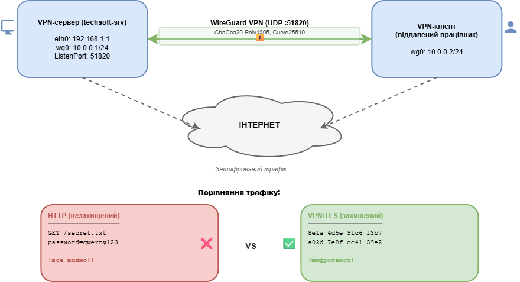

# Звіт з практичної роботи №5

## VPN та захист каналів зв'язку

---

**Дисципліна:** Технології створення та застосування систем захисту ІКС

**Студент:** Іванов І.І.

**Група:** КБ-21м

**Дата виконання:** 18.02.2026

---

## 1. Мета роботи

Зрозуміти принципи роботи VPN та побачити різницю між захищеним і незахищеним трафіком. Навчитися генерувати криптографічні ключі WireGuard, створювати конфігураційні файли VPN-сервера та клієнта, а також аналізувати мережевий трафік за допомогою `tcpdump`.

---

## 2. Схема VPN-з'єднання



---

## 3. Встановлення WireGuard та генерація ключів

### Встановлення

```
student@techsoft-srv:~$ sudo apt update
Hit:1 http://archive.ubuntu.com/ubuntu jammy InRelease
...
Reading package lists... Done

student@techsoft-srv:~$ sudo apt install -y wireguard-tools
Reading package lists... Done
Building dependency tree... Done
The following NEW packages will be installed:
  wireguard-tools
Setting up wireguard-tools (1.0.20210914-1ubuntu2) ...
```

### Генерація ключів

```
student@techsoft-srv:~$ wg genkey | tee privatekey | wg pubkey > publickey

student@techsoft-srv:~$ cat privatekey
qWe3V7kR9xL2cF5hJ8wQ0pDy4tGi6uAo1eSf8aZjXnM=

student@techsoft-srv:~$ cat publickey
kHs9J2mR7xL4cF6hN8wQ0pBv3dYt5iUo1eSf8aZjXnE=

student@techsoft-srv:~$ ls -la privatekey publickey
-rw------- 1 student student 45 Feb 18 10:15 privatekey
-rw-r--r-- 1 student student 45 Feb 18 10:15 publickey
```

### Таблиця ключів

| Тип ключа | Значення | Призначення |
|---|---|---|
| Приватний | `qWe3V7***ЗАМАСКОВАНО***XnM=` | Шифрування/розшифрування трафіку. Зберігається тільки локально |
| Публічний | `kHs9J2mR7xL4cF6hN8wQ0pBv3dYt5iUo1eSf8aZjXnE=` | Передається іншій стороні (peer) для автентифікації |

**Приватний ключ** -- 32-байтний секретний ключ (Base64). Зберігається тільки на своєму хості, ніколи не передається. Використовується для розшифрування вхідного трафіку.

**Публічний ключ** -- обчислюється з приватного за допомогою операції на еліптичній кривій Curve25519. Передається іншій стороні для взаємної автентифікації та обчислення спільного секрету (ECDH).

---

## 4. Конфігураційні файли з поясненням параметрів

### Конфігурація сервера (`wg0.conf`)

```ini
[Interface]
PrivateKey = qWe3V7kR9xL2cF5hJ8wQ0pDy4tGi6uAo1eSf8aZjXnM=
Address = 10.0.0.1/24
ListenPort = 51820

[Peer]
PublicKey = dMk4L8nT2xW6cR9vP5jQ0pEy3dFi7uAo1aSg8kZlYwC=
AllowedIPs = 10.0.0.2/32
```

### Конфігурація клієнта (`wg0-client.conf`)

```ini
[Interface]
PrivateKey = rTx5R8mK2vN7cF3hJ9wL0pDy4tGi6uBo1eSf8aYjXnR=
Address = 10.0.0.2/24
DNS = 8.8.8.8

[Peer]
PublicKey = kHs9J2mR7xL4cF6hN8wQ0pBv3dYt5iUo1eSf8aZjXnE=
Endpoint = 192.168.1.1:51820
AllowedIPs = 10.0.0.0/24
PersistentKeepalive = 25
```

### Пояснення параметрів

| Параметр | Пояснення |
|---|---|
| `PrivateKey` | Приватний ключ хосту для шифрування/розшифрування. Разом із публічним ключем peer обчислюється спільний секрет |
| `Address` | IP-адреса VPN-інтерфейсу wg0 та маска підмережі тунелю |
| `ListenPort` | UDP-порт сервера для вхідних VPN-з'єднань (стандартний: 51820) |
| `PublicKey` | Публічний ключ протилежної сторони для автентифікації |
| `AllowedIPs` | Дозволені IP для peer. На сервері `10.0.0.2/32` обмежує клієнта однією адресою; на клієнті `10.0.0.0/24` направляє корпоративний трафік через VPN (split tunnel) |
| `Endpoint` | Фізична IP-адреса та порт VPN-сервера |
| `PersistentKeepalive` | Інтервал keepalive-пакетів (25 сек.) для підтримки NAT-сесії |
| `DNS` | DNS-сервер при активному VPN-з'єднанні |

---

## 5. Результати tcpdump

### Незахищений HTTP-трафік

```
student@techsoft-srv:~$ echo "TechSoft CRM: login=admin password=Ts#2026! api_key=sk-proj-abc123" > /tmp/secret.txt
student@techsoft-srv:~$ cd /tmp && python3 -m http.server 8080 &
[1] 4521
Serving HTTP on 0.0.0.0 port 8080 (http://0.0.0.0:8080/) ...

student@techsoft-srv:~$ sudo tcpdump -i lo port 8080 -A -c 10 &
listening on lo, link-type EN10MB (Ethernet), snapshot length 262144 bytes

student@techsoft-srv:~$ curl http://localhost:8080/secret.txt
TechSoft CRM: login=admin password=Ts#2026! api_key=sk-proj-abc123
```

Вивід tcpdump:

```
10:30:45.678901 IP localhost.54312 > localhost.8080: Flags [P.], seq 1:78, ack 1, length 77
GET /secret.txt HTTP/1.1
Host: localhost:8080
User-Agent: curl/7.81.0
Accept: */*

10:30:45.679234 IP localhost.8080 > localhost.54312: Flags [P.], seq 1:236, ack 78, length 235
HTTP/1.0 200 OK
Server: SimpleHTTP/0.6 Python/3.10.12
Content-type: text/plain
Content-Length: 68

TechSoft CRM: login=admin password=Ts#2026! api_key=sk-proj-abc123
```

**Аналіз:** У виводі tcpdump для HTTP чітко видно: запит `GET /secret.txt`, заголовки `Host`, `User-Agent`, а також повний вміст файлу, включаючи логін `admin`, пароль `Ts#2026!` та API-ключ. Зловмисник з доступом до мережі бачить усі дані у відкритому вигляді.

### Зашифрований HTTPS-трафік

```
student@techsoft-srv:~$ sudo tcpdump -i eth0 port 443 -X -c 10 &
listening on eth0, link-type EN10MB (Ethernet), snapshot length 262144 bytes

student@techsoft-srv:~$ curl -s https://example.com > /dev/null
```

Вивід tcpdump:

```
10:32:12.345678 IP techsoft-srv.48762 > 93.184.216.34.443: Flags [P.], seq 1:218, ack 1, length 217
        0x0000:  4500 0101 a3f2 4000 4006 5c8a c0a8 0164  E.....@.@.\....d
        0x0010:  5db8 d822 be7a 01bb 1a4d 5e91 c6d2 8f3a  ]..".z...M^....:
        0x0020:  5018 ffff 2c84 0000 1703 0300 d4f7 b23c  P...,..........<
        0x0030:  8e1a 4d5e 91c6 d28f 3a7e 1b0d 4ca8 2f63  ..M^....:~..L./c
        0x0040:  94e5 b1d7 289c 0e47 f32a 81b6 d53e 9a1f  ....(..G.*...>..
10:32:12.456789 IP 93.184.216.34.443 > techsoft-srv.48762: Flags [P.], seq 1:1389, ack 218, length 1388
        0x0000:  4500 059c 7b21 4000 3406 c3e1 5db8 d822  E...{!@.4...]..".
        0x0010:  c0a8 0164 01bb be7a c6d2 8f3a 1a4d 5f6a  ...d...z...:.M_j
        0x0020:  5018 0100 8c27 0000 1703 0305 6b8c 15a7  P....'......k...
```

**Аналіз:** У виводі tcpdump для HTTPS видно лише IP-адреси та порт 443. Увесь вміст зашифрований -- лише hex-байти. Заголовок `1703 03` означає TLS Application Data. Неможливо визначити URL, заголовки чи вміст сторінки.

---

## 6. Порівняльна таблиця

| Характеристика | HTTP (незахищений) | VPN / TLS (захищений) |
|---|---|---|
| **Конфіденційність** | Відсутня. Видно `GET /secret.txt`, `password=Ts#2026!` | Забезпечена. Видно лише шифротекст |
| **Цілісність** | Не гарантована. Пакети можуть бути модифіковані (MITM) | Гарантована. Poly1305 / HMAC автентифікує кожен пакет |
| **Автентичність** | Відсутня. Немає перевірки сторін | Забезпечена. WireGuard: Curve25519, TLS: X.509 |
| **Захист від перехоплення** | Немає. Зловмисник бачить усе | Повний. Без приватного ключа розшифрування неможливе |
| **Видимість для провайдера** | Провайдер бачить URL, заголовки, вміст | Провайдер бачить лише IP та обсяг трафіку |

---

## 7. Відповіді на контрольні питання

### 1. Що таке VPN і які основні задачі він вирішує в контексті захисту каналів зв'язку ІКС?

VPN (Virtual Private Network) -- технологія, що створює захищений логічний канал зв'язку поверх незахищеної мережі. В контексті ІКС VPN забезпечує: конфіденційність (шифрування трафіку), цілісність (автентифікація пакетів, захист від MITM), автентифікацію сторін (криптографічні ключі/сертифікати), безпечне з'єднання віддалених підрозділів (site-to-site) та безпечний віддалений доступ працівників (remote-access).

### 2. Які криптографічні алгоритми використовує WireGuard?

- **Curve25519** -- обмін ключами (ECDH). Забезпечує 128-бітний рівень безпеки з короткими 32-байтними ключами.
- **ChaCha20** -- симетричне потокове шифрування даних. Стійкий до timing attacks.
- **Poly1305** -- автентифікація повідомлень (MAC). Гарантує цілісність кожного пакета.
- **BLAKE2s** -- хешування. Швидший за SHA-256 при тому ж рівні безпеки.

Фіксований набір алгоритмів виключає можливість вибору слабкої конфігурації адміністратором.

### 3. Різниця між split tunnel та full tunnel

**Split tunnel** (`AllowedIPs = 10.0.0.0/24`) -- через VPN іде лише корпоративний трафік. Переваги: менше навантаження на VPN-сервер, вища швидкість Інтернету. Недоліки: не весь трафік захищений, можливий витік DNS.

**Full tunnel** (`AllowedIPs = 0.0.0.0/0`) -- весь трафік проходить через VPN. Переваги: максимальний захист, контроль всього трафіку. Недоліки: вищі затримки, навантаження на сервер, single point of failure.

### 4. Параметр AllowedIPs та його подвійна роль

`AllowedIPs` виконує дві функції: **маршрутизація** -- визначає, до яких IP-адрес трафік направляється через VPN-тунель (WireGuard автоматично створює маршрути); **фільтрація** -- визначає, з яких IP дозволено приймати трафік від peer (пакети з інших адрес відкидаються). Наприклад, `AllowedIPs = 10.0.0.2/32` на сервері означає: приймати від цього peer тільки пакети з адресою 10.0.0.2 та направляти до нього трафік на 10.0.0.2.

### 5. Чому при аналізі VPN слід захоплювати трафік на фізичному інтерфейсі?

Мета аналізу -- перевірити, що бачить зловмисник, який перехоплює трафік у мережі. Зловмисник має доступ до фізичного інтерфейсу (eth0), де трафік зашифрований. На VPN-інтерфейсі (wg0) трафік вже розшифрований WireGuard, тому аналіз на wg0 покаже відкриті дані і створить хибне враження, що VPN не працює. Аналіз на eth0 наочно демонструє, що зловмисник бачить лише зашифровані UDP-пакети.

---

## 8. Висновки

У ході виконання практичної роботи було:

1. **Встановлено WireGuard та згенеровано ключі** -- створено пару криптографічних ключів (Curve25519). Приватний ключ зберігається локально, публічний -- передається peer.

2. **Створено конфігураційні файли** сервера та клієнта з детальним поясненням кожного параметра (PrivateKey, Address, ListenPort, PublicKey, AllowedIPs, Endpoint, PersistentKeepalive).

3. **Продемонстровано різницю** між захищеним та незахищеним трафіком за допомогою tcpdump: HTTP-трафік повністю читабельний (видно логіни, паролі, вміст файлів), тоді як HTTPS/TLS-трафік зашифрований і не піддається аналізу.

4. **Заповнено порівняльну таблицю** за 5 параметрами, яка наочно демонструє переваги шифрування каналів зв'язку.

VPN на базі WireGuard є ефективним засобом захисту каналів зв'язку ІКС завдяки простоті конфігурації, сучасним криптографічним алгоритмам та мінімальній поверхні атаки (~4000 рядків коду).
