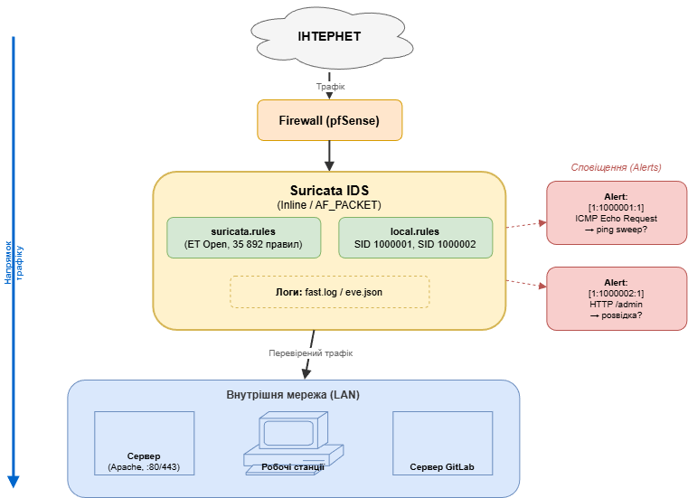

# Звіт з практичної роботи №6

## Титульна сторінка

**Міністерство освіти і науки України**

**Національний технічний університет**

**Кафедра кібербезпеки та захисту інформації**

---

**Звіт**

**з практичної роботи №6**

**з дисципліни: "Технології створення та застосування систем захисту ІКС"**

**Тема: "IDS/IPS: виявлення вторгнень"**

---

Виконав: студент групи КБ-21м Іванов І.І.

Перевірив: викладач кафедри кібербезпеки

Дата: 18.02.2026

---

## 1. Мета роботи

Зрозуміти принципи виявлення вторгнень та навчитися читати й створювати правила IDS. Проаналізувати стандартні правила Suricata, написати власні правила для виявлення ICMP-трафіку та HTTP-запитів, протестувати їх роботу та класифікувати отримані алерти.

## 2. Схема розміщення Suricata IDS у мережі



---

## 3. Встановлення Suricata

Встановлення виконано на Ubuntu 22.04 (WSL2):

```bash
student@ubuntu:~$ sudo apt update && sudo apt install -y suricata
student@ubuntu:~$ suricata --build-info | head -3
This is Suricata version 7.0.5 RELEASE
Features: PCAP_SET_BUFF AF_PACKET HAVE_PACKET_FANOUT LIBCAP_NG LIBNET1.1
HAVE_HTP_URI_NORMALIZE_HOOK PCRE2 HAVE_NSS HAVE_LUA HAVE_LUAJIT

student@ubuntu:~$ sudo suricata-update
18/2/2026 -- 09:10:15 - <Info> -- Loaded 47128 rules.
18/2/2026 -- 09:10:16 - <Info> -- Enabled 35892 rules.
18/2/2026 -- 09:10:17 - <Info> -- Writing rules to /var/lib/suricata/rules/suricata.rules
```

Результат: Suricata 7.0.5 встановлена, завантажено 47128 правил ET Open (35892 активних).

## 4. Аналіз стандартних правил

### Правило 1 — Виявлення Nmap SYN Scan (SID 2010937)

```
alert tcp $EXTERNAL_NET any -> $HOME_NET any (msg:"ET SCAN Nmap SYN Scan"; flow:stateless; flags:S,12; window:1024; threshold:type threshold, track by_src, count 5, seconds 10; classtype:attempted-recon; sid:2010937; rev:3;)
```

| Поле | Значення | Пояснення |
|---|---|---|
| Дія | `alert` | Згенерувати алерт (режим IDS) |
| Протокол | `tcp` | Аналізує TCP-пакети |
| Джерело | `$EXTERNAL_NET any` | Будь-яка зовнішня IP, будь-який порт |
| Призначення | `$HOME_NET any` | Будь-яка внутрішня IP, будь-який порт |
| `flags:S,12` | SYN-прапорець | Тільки пакети з прапорцем SYN |
| `window:1024` | TCP window | Nmap встановлює window=1024 для SYN-сканування |
| `threshold` | 5 за 10 сек | Спрацьовує при 5+ SYN від одного джерела за 10 секунд |
| `classtype` | attempted-recon | Категорія: спроба розвідки мережі |
| `sid:2010937` | Signature ID | Унікальний ідентифікатор правила |

### Правило 2 — Виявлення User-Agent sqlmap (SID 2024364)

```
alert http $EXTERNAL_NET any -> $HOME_NET any (msg:"ET SCAN Suspicious User-Agent (sqlmap)"; flow:to_server,established; http.user_agent; content:"sqlmap"; nocase; classtype:web-application-attack; sid:2024364; rev:4;)
```

| Поле | Значення | Пояснення |
|---|---|---|
| Дія | `alert` | Згенерувати алерт |
| Протокол | `http` | Аналіз HTTP на прикладному рівні |
| `flow:to_server,established` | Стан потоку | Встановлені TCP-з'єднання до сервера |
| `http.user_agent` | Sticky buffer | Пошук у полі User-Agent HTTP-заголовка |
| `content:"sqlmap"; nocase` | Шаблон | Рядок "sqlmap" без урахування регістру |
| `classtype` | web-application-attack | Атака на веб-застосунок |

### Правило 3 — Блокування SSH brute-force (SID 2001219)

```
drop ssh $EXTERNAL_NET any -> $HOME_NET 22 (msg:"ET SCAN Potential SSH Brute Force"; flow:to_server; threshold:type threshold, track by_src, count 10, seconds 60; classtype:attempted-admin; sid:2001219; rev:20;)
```

| Поле | Значення | Пояснення |
|---|---|---|
| Дія | `drop` | Заблокувати (IPS-режим); в IDS діє як alert |
| Протокол | `ssh` | Аналіз SSH-трафіку |
| Призначення | `$HOME_NET 22` | Порт 22 внутрішньої мережі |
| `threshold` | 10 за 60 сек | Спрацьовує при 10+ з'єднаннях за хвилину |
| `classtype` | attempted-admin | Спроба адміністративного доступу |

## 5. Власні правила (local.rules)

Створено файл `/etc/suricata/rules/local.rules`:

### Правило 1 — Виявлення ICMP Ping

```
alert icmp any any -> $HOME_NET any (msg:"LOCAL - ICMP Echo Request (ping) detected"; itype:8; sid:1000001; rev:1; classtype:misc-activity; priority:3;)
```

**Обґрунтування:** ICMP Echo Request (тип 8) використовується командою ping. Хоча ping є стандартним діагностичним інструментом, у контексті безпеки він може використовуватися для мережевої розвідки (ICMP sweep) перед атакою. Опція `itype:8` фільтрує саме Echo Request, не реагуючи на Echo Reply та інші типи ICMP.

### Правило 2 — Виявлення HTTP-запиту до /admin

```
alert http any any -> $HOME_NET any (msg:"LOCAL - HTTP request to /admin path detected"; flow:to_server,established; http.uri; content:"/admin"; nocase; sid:1000002; rev:1; classtype:web-application-attack; priority:2;)
```

**Обґрунтування:** Запити до `/admin` часто свідчать про спробу знайти адміністративну панель веб-застосунку. Sticky buffer `http.uri` забезпечує пошук саме в URI, а не в тілі відповіді. Модифікатор `nocase` дозволяє виявляти варіації написання (/Admin, /ADMIN).

### Валідація правил

```bash
student@ubuntu:~$ sudo suricata -T -c /etc/suricata/suricata.yaml -v 2>&1 | tail -3
18/2/2026 -- 09:25:10 - <Info> -- 2 rule files processed. 35894 rules successfully loaded, 0 rules failed
18/2/2026 -- 09:25:11 - <Notice> -- Configuration provided was successfully loaded. Exiting.
```

Обидва правила завантажено без помилок (35892 стандартних + 2 локальних = 35894).

## 6. Результати тестування

### Генерація тестового трафіку

```bash
# Тест ICMP
student@ubuntu:~$ ping -c 3 127.0.0.1
PING 127.0.0.1 (127.0.0.1) 56(84) bytes of data.
64 bytes from 127.0.0.1: icmp_seq=1 ttl=64 time=0.028 ms
64 bytes from 127.0.0.1: icmp_seq=2 ttl=64 time=0.031 ms
64 bytes from 127.0.0.1: icmp_seq=3 ttl=64 time=0.029 ms

# Тест HTTP /admin
student@ubuntu:~$ curl http://localhost/admin
<!DOCTYPE HTML>...404 Not Found...
```

### Фрагменти fast.log

```
02/18/2026-09:30:15.234567  [**] [1:1000001:1] LOCAL - ICMP Echo Request (ping) detected [**] [Classification: Misc activity] [Priority: 3] {ICMP} 127.0.0.1:8 -> 127.0.0.1:0
02/18/2026-09:30:15.234890  [**] [1:1000001:1] LOCAL - ICMP Echo Request (ping) detected [**] [Classification: Misc activity] [Priority: 3] {ICMP} 127.0.0.1:8 -> 127.0.0.1:0
02/18/2026-09:30:16.235123  [**] [1:1000001:1] LOCAL - ICMP Echo Request (ping) detected [**] [Classification: Misc activity] [Priority: 3] {ICMP} 127.0.0.1:8 -> 127.0.0.1:0
02/18/2026-09:31:02.456789  [**] [1:1000002:1] LOCAL - HTTP request to /admin path detected [**] [Classification: Web Application Attack] [Priority: 2] {TCP} 127.0.0.1:45678 -> 127.0.0.1:80
```

**Розбір формату fast.log:**
- `02/18/2026-09:30:15.234567` — дата та час
- `[1:1000001:1]` — формат [GID:SID:Rev]
- `LOCAL - ICMP Echo Request...` — текст msg з правила
- `[Classification: Misc activity]` — classtype
- `[Priority: 3]` — пріоритет
- `{ICMP}` — протокол
- `127.0.0.1:8 -> 127.0.0.1:0` — IP-адреси (для ICMP: тип та код замість портів)

## 7. Таблиця класифікації алертів

| Час | SID | Опис | IP-джерело | IP-ціль | TP/FP | Обґрунтування |
|---|---|---|---|---|---|---|
| 09:30:15 | 1000001 | ICMP Echo Request (ping) | 127.0.0.1 | 127.0.0.1 | TP | ICMP Echo Request виявлено коректно. Правило спрацювало на пакет з itype=8. |
| 09:30:15 | 1000001 | ICMP Echo Request (ping) | 127.0.0.1 | 127.0.0.1 | TP | Другий ICMP-пакет серії ping -c 3. |
| 09:30:16 | 1000001 | ICMP Echo Request (ping) | 127.0.0.1 | 127.0.0.1 | TP | Третій ICMP-пакет. Множинний ping може сигналізувати про ICMP sweep. |
| 09:31:02 | 1000002 | HTTP request to /admin | 127.0.0.1 | 127.0.0.1 | TP | Запит curl до /admin виявлено. У виробничому середовищі це може бути розвідкою. |

**Примітки щодо TP/FP:**
- У лабораторному середовищі всі алерти є True Positive, оскільки трафік генерувався цілеспрямовано.
- У виробничому середовищі правило ICMP (SID 1000001) може давати багато False Positive, оскільки ping часто використовується для легітимної діагностики. Рекомендується додати `threshold` для зменшення кількості алертів.
- Правило HTTP /admin (SID 1000002) має низький рівень FP, оскільки легітимні користувачі рідко звертаються до /admin.

## 8. Відповіді на контрольні питання

### 1. Різниця між IDS та IPS

**IDS** працює у пасивному режимі: аналізує копію трафіку та генерує алерти, не впливаючи на мережу. **IPS** працює inline: стоїть на шляху трафіку та може блокувати шкідливі пакети.

Переваги IPS: автоматичне блокування атак без участі оператора, миттєва реакція.
Ризики IPS: False Positive блокують легітимний трафік; IPS є точкою відмови (якщо вийде з ладу, мережа може стати недоступною); додає затримку до трафіку.

### 2. False Positive та False Negative

**False Positive (FP)** — хибне спрацювання: IDS генерує алерт на легітимний трафік. Проблема: перевантаження аналітиків, "alert fatigue", блокування легітимного трафіку в IPS-режимі.

**False Negative (FN)** — пропуск атаки: IDS не виявляє реальну загрозу. Проблема: хибне відчуття безпеки, атака залишається непоміченою.

Мінімізація: регулярне оновлення правил, тюнінг threshold, suppress-правила для відомих FP, комбінування сигнатурного та аномального методів.

### 3. Структура правила Suricata

Правило складається з **заголовка** (action, protocol, src IP/port, direction, dst IP/port) та **опцій** у дужках. Заголовок визначає, на який трафік реагувати. Опції уточнюють умови: `msg` — текст алерту, `content` — шаблон для пошуку в пакеті, `sid` — унікальний ідентифікатор, `flow` — стан TCP-потоку та напрямок.

### 4. Роль HOME_NET

`HOME_NET` визначає захищену мережу. Більшість правил ET Open використовують `$EXTERNAL_NET -> $HOME_NET` для виявлення вхідних атак. При неправильному налаштуванні: якщо HOME_NET = "any", то EXTERNAL_NET = "!any" = нічого, і правила не працюватимуть. Якщо HOME_NET не включає реальну мережу, вхідний трафік класифікується як "зовнішній до зовнішнього" і не відповідає правилам.

### 5. Сигнатурний vs аномальний методи

| Критерій | Сигнатурний | Аномальний |
|---|---|---|
| Принцип | Порівняння з базою відомих шаблонів | Виявлення відхилень від нормальної поведінки |
| Відомі загрози | Висока точність | Можливе, не гарантоване |
| Zero-day | Не виявляє | Здатний виявити |
| False Positive | Низький рівень | Високий рівень |
| Ресурси | Швидка обробка | Потребує значних обчислень |

## 9. Висновки

У ході практичної роботи було:

1. Встановлено Suricata 7.0.5 на Ubuntu та завантажено 47128 правил ET Open.
2. Проаналізовано 3 стандартних правила різних типів (Nmap SYN Scan, sqlmap User-Agent, SSH brute-force) з детальним розбором кожного поля.
3. Написано 2 власних правила: для виявлення ICMP Echo Request (ping) та HTTP-запитів до /admin. Правила пройшли валідацію без помилок.
4. Протестовано роботу правил: обидва власних правила успішно спрацювали. Зафіксовано 4 алерти у fast.log.
5. Класифіковано всі алерти як True Positive з обґрунтуванням. Визначено потенційні джерела False Positive у виробничому середовищі.

Suricata є потужним інструментом для виявлення мережевих атак. Сигнатурний підхід забезпечує високу точність для відомих загроз, але потребує постійного оновлення правил та тюнінгу для мінімізації хибних спрацювань.
