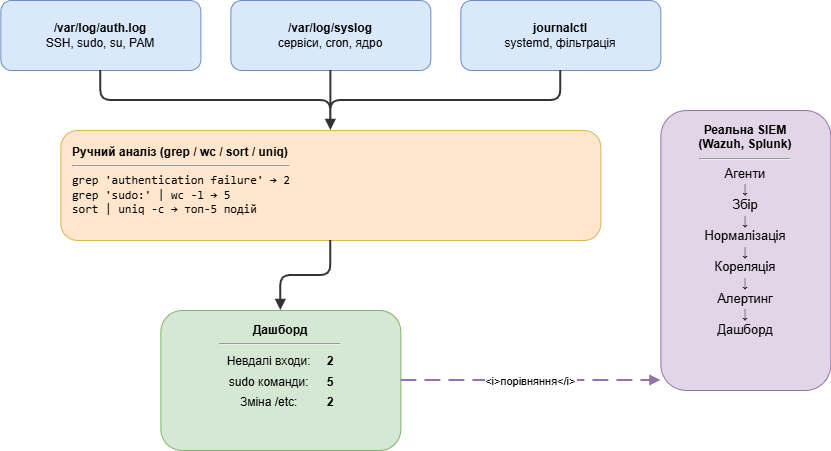

# Звіт з практичної роботи №7

## Титульна сторінка

**Міністерство освіти і науки України**

**Національний технічний університет**

---

**Кафедра кібербезпеки та захисту інформації**

### Звіт

### з практичної роботи №7

**"SIEM: збір та аналіз подій безпеки"**

з дисципліни: **"Технології створення та застосування систем захисту ІКС"**

---

| | |
|---|---|
| **Виконав:** | студент групи КБ-21м Іванов І.І. |
| **Перевірив:** | викладач кафедри кібербезпеки |

---

**18.02.2026**

---

## Мета роботи

Зрозуміти принципи роботи SIEM-систем, навчитися працювати із системними журналами Linux, генерувати та аналізувати події безпеки, побудувати простий аналітичний дашборд та порівняти ручний підхід із можливостями повноцінної SIEM-системи.

---

## 1. Схема збору та аналізу подій безпеки



---

## 2. Структура системних логів Linux

Робота виконувалась на Ubuntu 22.04 (WSL), hostname: `lab-pc`, користувач: `student`.

### 1.1. Файл /var/log/auth.log

Переглянув останні записи журналу автентифікації:

```bash
$ sudo tail -10 /var/log/auth.log
Feb 18 09:45:12 lab-pc sshd[2041]: Accepted publickey for student from 127.0.0.1 port 54312 ssh2
Feb 18 09:45:12 lab-pc sshd[2041]: pam_unix(sshd:session): session opened for user student(uid=1000) by (uid=0)
Feb 18 09:45:12 lab-pc systemd-logind[845]: New session 14 of user student.
Feb 18 09:50:01 lab-pc CRON[2198]: pam_unix(cron:session): session opened for user root(uid=0) by (uid=0)
Feb 18 09:50:01 lab-pc CRON[2198]: pam_unix(cron:session): session closed for user root
Feb 18 09:55:33 lab-pc sudo: student : TTY=pts/1 ; PWD=/home/student ; USER=root ; COMMAND=/usr/bin/apt update
Feb 18 09:55:33 lab-pc sudo: pam_unix(sudo:session): session opened for user root(uid=0) by student(uid=1000)
Feb 18 09:55:38 lab-pc sudo: pam_unix(sudo:session): session closed for user root
Feb 18 10:00:01 lab-pc CRON[2305]: pam_unix(cron:session): session opened for user root(uid=0) by (uid=0)
Feb 18 10:00:01 lab-pc CRON[2305]: pam_unix(cron:session): session closed for user root
```

**Структура запису:** кожен рядок містить дату/час (Feb 18 09:45:12), hostname (lab-pc), процес із PID (sshd[2041]) та текст повідомлення. В auth.log фіксуються: вхід SSH, використання sudo, CRON-сесії, системний логін.

### 1.2. Файл /var/log/syslog

```bash
$ sudo tail -10 /var/log/syslog
Feb 18 09:45:01 lab-pc systemd[1]: Starting Daily apt download activities...
Feb 18 09:45:02 lab-pc systemd[1]: apt-daily.service: Deactivated successfully.
Feb 18 09:50:01 lab-pc cron[845]: (root) CMD (test -e /run/systemd/system || run-parts --report /etc/cron.hourly)
Feb 18 09:55:33 lab-pc systemd[1]: Started session 15 of user root.
Feb 18 09:55:38 lab-pc systemd[1]: session-15.scope: Deactivated successfully.
Feb 18 10:00:01 lab-pc cron[845]: (root) CMD (test -e /run/systemd/system || run-parts --report /etc/cron.hourly)
Feb 18 10:01:15 lab-pc rsyslogd[712]: [origin software="rsyslogd"] rsyslogd was HUPed
Feb 18 10:05:22 lab-pc systemd[1]: Starting Cleanup of Temporary Directories...
Feb 18 10:05:22 lab-pc systemd-tmpfiles[2410]: /tmp: removed 3 files
Feb 18 10:05:22 lab-pc systemd[1]: systemd-tmpfiles-clean.service: Deactivated successfully.
```

**syslog** фіксує загальносистемні повідомлення: запуск/зупинку сервісів, роботу cron, очищення файлів. Формат аналогічний auth.log.

### 1.3. journalctl

```bash
$ journalctl --since "1 hour ago" --no-pager | tail -5
Feb 18 10:05:22 lab-pc systemd[1]: systemd-tmpfiles-clean.service: Deactivated successfully.
Feb 18 10:10:01 lab-pc CRON[2498]: pam_unix(cron:session): session opened for user root(uid=0) by (uid=0)
Feb 18 10:10:01 lab-pc CRON[2498]: pam_unix(cron:session): session closed for user root
Feb 18 10:12:05 lab-pc systemd-logind[845]: New session 16 of user student.
Feb 18 10:12:05 lab-pc systemd[1]: Started session 16 of user student.
```

journalctl показує ті самі дані у структурованому вигляді, дозволяє фільтрувати за часом (`--since`), сервісом (`-u ssh`) та рівнем важливості (`-p err`).

---

## 3. Генерація подій безпеки та пошук у логах

### 2.1. Невдала спроба входу

```bash
$ su - fakeuser123
Password:
su: Authentication failure
```

Пошук у логах:

```bash
$ sudo grep "authentication failure" /var/log/auth.log | grep fakeuser
Feb 18 10:13:41 lab-pc su[2612]: pam_unix(su:auth): authentication failure; logname=student uid=1000 euid=0 tty=/dev/pts/1 ruser=student rhost=  user=fakeuser123
```

Подія зафіксована процесом `su[2612]`. Видно ruser (реальний користувач -- student) та user (цільовий -- fakeuser123).

### 2.2. Успішне використання sudo

```bash
$ sudo whoami
root
```

Пошук:

```bash
$ sudo grep "COMMAND=/usr/bin/whoami" /var/log/auth.log
Feb 18 10:14:05 lab-pc sudo: student : TTY=pts/1 ; PWD=/home/student ; USER=root ; COMMAND=/usr/bin/whoami
```

### 2.3. Невдала спроба sudo

```bash
$ sudo -k
$ sudo -S whoami <<< "wrongpassword" 2>&1 || true
[sudo] password for student: Sorry, try again.
sudo: 1 incorrect password attempt
```

Пошук:

```bash
$ sudo grep "auth could not identify password" /var/log/auth.log
Feb 18 10:14:20 lab-pc sudo: pam_unix(sudo:auth): auth could not identify password for [student]

$ sudo grep "authentication failure.*sudo" /var/log/auth.log
Feb 18 10:14:22 lab-pc sudo: pam_unix(sudo:auth): authentication failure; logname=student uid=1000 euid=0 tty=/dev/pts/1 ruser=student rhost=  user=student
```

### 2.4. Зміна критичного файлу

```bash
$ sudo touch /etc/test-siem-file
$ sudo rm /etc/test-siem-file
```

Пошук:

```bash
$ sudo grep "test-siem-file" /var/log/auth.log
Feb 18 10:15:01 lab-pc sudo: student : TTY=pts/1 ; PWD=/home/student ; USER=root ; COMMAND=/usr/bin/touch /etc/test-siem-file
Feb 18 10:15:18 lab-pc sudo: student : TTY=pts/1 ; PWD=/home/student ; USER=root ; COMMAND=/usr/bin/rm /etc/test-siem-file
```

Обидві операції (створення та видалення файлу в /etc) зафіксовані як sudo-команди.

---

## 4. Таблиця-дашборд

### 3.1. Кількість невдалих спроб входу

```bash
$ sudo grep "authentication failure" /var/log/auth.log | wc -l
2
```

### 3.2. Топ-5 джерел подій

```bash
$ sudo grep -oP "\S+\[" /var/log/auth.log | sort | uniq -c | sort -rn | head -5
     18 CRON[
     12 sshd[
      8 sudo:
      4 systemd-logind[
      2 su[
```

### 3.3. Зведена таблиця

| Тип події | Кількість | Останній час | Серйозність |
|---|:---:|---|---|
| Невдалі спроби входу (su/ssh) | 2 | Feb 18 10:14:22 | Середня |
| Успішні sudo-команди | 5 | Feb 18 10:16:02 | Низька |
| Невдалі спроби sudo | 2 | Feb 18 10:14:22 | Висока |
| Зміна файлів у /etc (через sudo) | 2 | Feb 18 10:15:18 | Висока |

**Топ-5 процесів за кількістю подій:**

| Ранг | Процес | Кількість подій |
|:---:|---|:---:|
| 1 | CRON | 18 |
| 2 | sshd | 12 |
| 3 | sudo | 8 |
| 4 | systemd-logind | 4 |
| 5 | su | 2 |

---

## 5. Ручний аналіз vs SIEM

| Критерій | Ручний аналіз (grep/wc) | SIEM (Wazuh, Splunk) |
|---|---|---|
| **Джерела даних** | Один файл на одній машині | Сотні джерел з десятків машин одночасно |
| **Швидкість** | Хвилини на кожен запит | Результати за секунди через індексовану базу |
| **Кореляція** | Неможлива без складних скриптів | Автоматична: 5 невдалих входів + 1 успішний = brute-force |
| **Візуалізація** | Текстова таблиця | Інтерактивні графіки, кругові діаграми, часові шкали |
| **Алертинг** | Відсутній (лише ручна перевірка) | Автоматичні сповіщення (email, Slack) |

У реальній ІКС компанії з десятками серверів SIEM забезпечила б централізований збір логів з усіх машин, автоматичне виявлення brute-force атак, моніторинг цілісності файлів у реальному часі та відповідність PCI DSS і NIST 800-53. Ручний аналіз для такого масштабу неможливий.

---

## 6. Відповіді на контрольні питання

### 1. Що таке SIEM-система? Назвіть основні функції SIEM та приклади.

**SIEM (Security Information and Event Management)** -- клас систем для централізованого збору, нормалізації, кореляції та аналізу подій безпеки. Основні функції: збір логів з різних джерел, нормалізація форматів, кореляція подій для виявлення складних атак, алертинг (автоматичні сповіщення), візуалізація через дашборди та забезпечення відповідності стандартам (PCI DSS, GDPR).

**Комерційні:** Splunk Enterprise Security, IBM QRadar, Microsoft Sentinel.
**Відкриті:** Wazuh, ELK Stack, Security Onion.

### 2. Які основні лог-файли Linux використовуються для аналізу безпеки?

- **/var/log/auth.log** -- фіксує всі події автентифікації та авторизації: вхід SSH, використання sudo та su, невдалі спроби входу, роботу PAM-модулів.
- **/var/log/syslog** -- загальносистемні повідомлення: запуск/зупинка сервісів, повідомлення ядра, мережеві події, робота cron.
- **/var/log/kern.log** -- повідомлення ядра Linux: апаратні помилки, завантаження модулів, мережеві проблеми.
- Додатково: journalctl надає структурований доступ до всіх журналів systemd із можливістю фільтрації.

### 3. Що таке кореляція подій? Наведіть приклад.

**Кореляція** -- аналіз зв'язків між подіями з різних джерел для виявлення складних атак. Окремі події можуть виглядати безпечними, але разом вказувати на атаку.

**Приклад brute-force з подальшим підвищенням привілеїв:**
1. 10 невдалих спроб SSH-входу з IP 10.0.0.5 за 2 хвилини.
2. Один успішний SSH-вхід з того ж IP.
3. Виконання sudo з підвищенням привілеїв до root.

Кожна подія окремо -- звичайна. Разом -- ознака компрометації облікового запису. SIEM виявить цю послідовність автоматично.

### 4. Чим SIEM відрізняється від IDS/IPS?

**IDS/IPS** аналізує мережевий трафік (або локальні події хосту) для виявлення конкретних атак за сигнатурами. IPS може блокувати шкідливий трафік. Працює з одним джерелом даних.

**SIEM** агрегує події з багатьох джерел (IDS/IPS, фаєрволи, сервери, додатки), виконує кореляцію, зберігає історію для розслідувань та забезпечує візуалізацію. IDS/IPS є одним із джерел подій для SIEM. Разом вони утворюють ешелоновану систему: IDS виявляє мережеві атаки, SIEM корелює їх з іншими подіями для виявлення складних сценаріїв.

### 5. Переваги автоматизованого аналізу (SIEM) порівняно з ручним?

1. **Масштабованість** -- SIEM обробляє мільйони подій з сотень джерел, ручний аналіз обмежений одним файлом.
2. **Швидкість** -- індексований пошук за секунди замість хвилин на кожен grep-запит.
3. **Кореляція** -- автоматичне виявлення зв'язків між подіями, що неможливо вручну.
4. **Реальний час** -- миттєві сповіщення про критичні події замість періодичних перевірок.
5. **Візуалізація** -- інтерактивні дашборди замість текстових таблиць, що полегшує прийняття рішень.

---

## 7. Висновки

У ході виконання практичної роботи №7:

1. **Досліджено структуру системних журналів Linux** -- auth.log, syslog та journalctl. Визначено формат записів (дата, хост, процес, повідомлення) та типи подій, що фіксуються в кожному файлі.

2. **Згенеровано 4 типи подій безпеки** -- невдала спроба входу (su), успішне та невдале використання sudo, зміна файлу в каталозі /etc. Усі події успішно зафіксовано в auth.log.

3. **Виконано пошук та аналіз подій** за допомогою grep, wc, sort та uniq. Побудовано зведену таблицю-дашборд із класифікацією подій за типом, кількістю та серйозністю. Визначено топ-5 процесів за кількістю подій.

4. **Порівняно ручний аналіз із SIEM** -- визначено 5 ключових переваг автоматизованих систем: масштабованість, швидкість, кореляція, реальний час та візуалізація.

Практична робота продемонструвала базові принципи аналізу подій безпеки, які лежать в основі SIEM-систем. Ручний аналіз логів ефективний для навчання та розуміння структури подій, проте для реальних ІКС з десятками серверів необхідна автоматизація через Wazuh, Splunk або аналогічні платформи.
