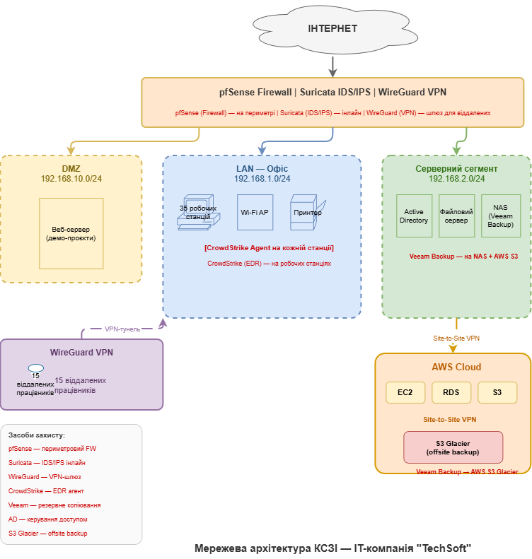

# Звіт з практичної роботи №8

## Проєктування КСЗІ для модельного об'єкта

| | |
|---|---|
| **Дисципліна** | Технології створення та застосування систем захисту ІКС |
| **Студент** | Іванов І.І. |
| **Група** | КБ-21м |
| **Варіант** | 1 — IT-компанія "TechSoft" (50 осіб) |
| **Дата виконання** | 18.02.2026 |

---

## Мета роботи

Навчитися обирати та обґрунтовувати засоби захисту для конкретної організації: описати об'єкт захисту, визначити ключові ІТ-системи та загрози, обрати 5 засобів захисту з різних категорій, побудувати схему мережі та скласти план впровадження.

---

## 1. Опис організації та ІТ-систем

### 1.1. Загальна інформація

ТОВ "TechSoft" — IT-компанія, що розробляє програмне забезпечення на замовлення (веб-додатки, мобільні додатки, хмарні рішення). Штат: 50 осіб (30 розробників, 5 DevOps, 5 менеджерів, 5 QA, 3 бухгалтери, 2 ІТ-адміністратори). Офіс розташовано у Києві, 15 працівників працюють віддалено з різних міст України. Інфраструктура включає 2 фізичні сервери в офісі, хмарні сервіси AWS, корпоративну пошту Google Workspace та Git-репозиторії на GitHub Enterprise.

### 1.2. Ключові ІТ-системи

| № | ІТ-система | Тип | Критичність |
|---|---|---|---|
| 1 | Контролер домену (Active Directory) | Сервер (on-premise) | Висока |
| 2 | Файловий сервер (документи, договори) | Сервер (on-premise) | Висока |
| 3 | GitHub Enterprise (Git-репозиторії, CI/CD) | Хмарний сервіс | Висока |
| 4 | AWS (EC2, RDS, S3 — продакшн клієнтів) | Хмарний сервіс | Висока |
| 5 | Google Workspace (пошта, документи, Meet) | Хмарний сервіс | Середня |
| 6 | Маршрутизатор Mikrotik (периметр мережі) | Мережеве обладнання | Висока |
| 7 | Робочі станції працівників (ноутбуки) | Кінцеві точки | Середня |

### 1.3. Топ-3 загрози

| № | Загроза | Джерело | Можливий вплив |
|---|---|---|---|
| 1 | Ransomware-атака з шифруванням серверів та робочих станцій | Зовнішній зловмисник (фішинг, вразливість) | Зупинка роботи компанії, втрата даних, фінансові збитки |
| 2 | Несанкціонований доступ через скомпрометовані облікові дані віддаленого працівника | Зовнішній зловмисник, крадіжка ноутбука | Витік вихідного коду та конфіденційних даних клієнтів |
| 3 | DDoS-атака або мережеве вторгнення через периметр | Зовнішній зловмисник, конкурент | Недоступність внутрішніх сервісів, порушення бізнес-процесів |

---

## 2. Обрані засоби захисту

| Категорія | Назва продукту | Яку загрозу нейтралізує | Вартість | Обґрунтування вибору |
|---|---|---|---|---|
| **Firewall** | pfSense CE | Загроза 3 (DDoS, мережеве вторгнення) | Безкоштовне (open-source) | pfSense замінить Mikrotik як основний firewall. Підтримує stateful inspection, NAT, VLAN-сегментацію. Безкоштовна ліцензія при достатній функціональності для 50 осіб. Активна спільнота та документація. |
| **IDS/IPS** | Suricata | Загроза 3 (вторгнення), Загроза 1 (C2-трафік ransomware) | Безкоштовне (open-source) | Suricata забезпечує глибокий аналіз мережевого трафіку з правилами ET Open. Інтегрується з pfSense як вбудований модуль. Багатопотокова обробка без зниження швидкості. |
| **VPN** | WireGuard | Загроза 2 (несанкціонований доступ) | Безкоштовне (open-source) | Сучасний криптографічний стек (Curve25519, ChaCha20), мінімальна поверхня атаки (~4000 рядків коду), низька затримка. Клієнти для macOS, Linux, Windows. Забезпечує шифрований тунель для 15 віддалених працівників. |
| **EDR** | CrowdStrike Falcon Go | Загроза 1 (ransomware) | ~5 USD/пристрій/міс | Провідне EDR-рішення з хмарною консоллю. Виявляє ransomware за поведінковими ознаками до шифрування файлів. Не потребує локального сервера — зручно для гібридного формату. |
| **Backup** | Veeam Backup & Replication CE | Загроза 1 (відновлення після ransomware) | Безкоштовне (до 10 інстансів) | Безкоштовне для 10 серверів/ВМ. Підтримує NAS та AWS S3. Верифікація бекапів (SureBackup). Стратегія 3-2-1: 3 копії, 2 типи носіїв, 1 offsite. |

---

## 3. Схема мережі (текстовий опис)

**Розміщення засобів захисту:**

- **pfSense (Firewall)** — на периметрі, між Інтернетом та внутрішніми сегментами (LAN, DMZ, серверний)
- **Suricata (IDS/IPS)** — інлайн на pfSense, інспектує весь вхідний/вихідний трафік
- **WireGuard (VPN)** — шлюз на pfSense для 15 віддалених працівників та site-to-site з AWS
- **CrowdStrike Falcon (EDR)** — агент на кожній робочій станції (50 шт.) та серверах
- **Veeam Backup** — на NAS Synology у серверному сегменті + репліка в AWS S3 Glacier

---

## 4. План впровадження

| Етап | Назва | Засоби захисту | Термін | Критерій завершення |
|---|---|---|---|---|
| **1** | Захист периметра мережі | pfSense, Suricata | 2 тижні | pfSense налаштовано: VLAN для LAN, DMZ, серверного сегмента; правила фільтрації активні; Suricata працює інлайн з ET Open; тестовий трафік коректно фільтрується |
| **2** | Захист доступу та кінцевих точок | WireGuard, CrowdStrike Falcon | 2 тижні | WireGuard: конфігурації для 15 віддалених працівників згенеровані та протестовані; Site-to-Site VPN з AWS працює. CrowdStrike: агент встановлено на 50 робочих станціях та 2 серверах |
| **3** | Резервне копіювання та перевірка | Veeam Backup | 1-2 тижні | Щоденний бекап AD та файлового сервера на NAS; репліка в AWS S3 Glacier; тестове відновлення сервера виконано успішно (RTO ≤ 4 год) |

**Загальна тривалість: 5-6 тижнів.**

**Обґрунтування послідовності:**

1. **Етап 1 (Периметр)** — першим, оскільки без firewall та IDS/IPS мережа відкрита для зовнішніх атак.
2. **Етап 2 (Доступ і кінцеві точки)** — другим: VPN забезпечує безпечний канал для віддалених працівників, EDR захищає від ransomware.
3. **Етап 3 (Backup)** — останнім, як "остання лінія оборони" для відновлення після успішної атаки.

---

## 5. Відповіді на контрольні питання

### 1. Поясніть принцип ешелонованого захисту (Defense in Depth). Як цей принцип реалізовано у вашому проєкті?

Принцип ешелонованого захисту передбачає побудову кількох незалежних рівнів (ешелонів) захисту. Якщо один рівень буде подолано, наступний продовжує забезпечувати безпеку.

У проєкті КСЗІ для "TechSoft" реалізовано такі ешелони:

1. **Мережевий периметр** — pfSense firewall фільтрує трафік + Suricata IDS/IPS виявляє вторгнення.
2. **Мережева сегментація** — VLAN розділяють LAN, DMZ та серверний сегмент, обмежуючи латеральний рух.
3. **Захищений доступ** — WireGuard VPN шифрує канал для віддалених працівників.
4. **Захист кінцевих точок** — CrowdStrike EDR виявляє та блокує ransomware на робочих станціях.
5. **Відновлення** — Veeam Backup забезпечує відновлення навіть після успішної атаки.

### 2. За якими критеріями слід обирати засоби захисту для КСЗІ? Порівняйте open-source та комерційні рішення.

Основні критерії вибору: відповідність загрозам, сумісність з інфраструктурою, масштабованість, вартість володіння (TCO), наявність підтримки та документації.

| Критерій | Open-source | Комерційні |
|---|---|---|
| Вартість ліцензії | Безкоштовно | Від сотень до тисяч USD/рік |
| Підтримка | Спільнота, форуми | Гарантована підтримка вендора (SLA) |
| Функціональність | Часто порівнянна | Може мати додаткові enterprise-функції |
| Гнучкість | Відкритий код, кастомізація | Обмежена конфігурацією вендора |

Для "TechSoft" використано комбінацію: open-source для інфраструктурних засобів (pfSense, Suricata, WireGuard, Veeam CE) та комерційне рішення для критичної задачі захисту кінцевих точок (CrowdStrike).

### 3. Чому важливо сегментувати мережу? Як це обмежує поширення атаки?

Мережева сегментація ділить мережу на ізольовані зони з окремими правилами доступу. Це важливо, оскільки:

- **Обмежує латеральний рух** — зловмисник, потрапивши в один сегмент, не може автоматично отримати доступ до інших.
- **Зменшує поверхню атаки** — кожен сегмент має лише необхідні відкриті порти.
- **Ізолює критичні ресурси** — серверний сегмент з AD та бекапами недоступний для звичайних працівників.

У проєкті створено 3 зони: DMZ (для зовнішніх сервісів), LAN (офісні робочі станції), серверний сегмент (AD, файловий сервер, NAS з бекапами). Навіть при компрометації робочої станції в LAN зловмисник не отримає прямого доступу до серверного сегмента.

### 4. Що буде, якщо один з обраних засобів захисту вийде з ладу?

Принцип ешелонованого захисту забезпечує резервування:

- **Якщо firewall вийде з ладу** — IDS/IPS та EDR на кінцевих точках продовжують виявляти загрози. Необхідно негайно відновити pfSense з бекапу конфігурації.
- **Якщо IDS/IPS перестане працювати** — firewall продовжує фільтрацію трафіку за правилами, EDR захищає кінцеві точки. Атаки на рівні додатків можуть залишитися непоміченими — критично відновити Suricata.
- **Якщо VPN недоступний** — віддалені працівники тимчасово не мають доступу до ресурсів. Це впливає на продуктивність, але не на безпеку.
- **Якщо EDR вийде з ладу** — firewall та IDS/IPS захищають мережевий периметр, але кінцеві точки вразливі до ransomware.
- **Якщо backup не працює** — всі інші засоби продовжують захист, але у разі успішної атаки відновлення буде неможливим. Тому критично моніторити статус бекапів.

### 5. Яка роль резервного копіювання у КСЗІ? Поясніть стратегію 3-2-1.

Резервне копіювання є "останньою лінією оборони" у КСЗІ. Навіть при подоланні всіх інших засобів захисту (наприклад, успішна ransomware-атака, яка зашифрувала файли), наявність актуальних бекапів дозволяє відновити дані та повернути системи до робочого стану.

**Стратегія 3-2-1:**
- **3 копії** даних (оригінал + 2 бекапи)
- **2 типи носіїв** (наприклад, NAS + хмара)
- **1 копія offsite** (за межами основної локації)

Offsite-копія критично важлива, оскільки ransomware або фізична катастрофа (пожежа, затоплення) може знищити як оригінал, так і локальний бекап. Копія в AWS S3 Glacier забезпечує відновлення навіть при повній втраті офісної інфраструктури.

---

## Висновки

У результаті виконання практичної роботи було спроєктовано КСЗІ для IT-компанії "TechSoft" (50 осіб, гібридний формат роботи).

Було виконано такі завдання:

1. **Описано об'єкт захисту** — визначено 7 ключових ІТ-систем та 3 найсерйозніші загрози (ransomware, несанкціонований доступ через облікові дані, мережеве вторгнення).

2. **Обрано 5 засобів захисту** з різних категорій: pfSense (firewall), Suricata (IDS/IPS), WireGuard (VPN), CrowdStrike Falcon (EDR), Veeam Backup (резервне копіювання). Для кожного засобу надано обґрунтування вибору з прив'язкою до конкретних загроз.

3. **Побудовано схему мережі** з позначенням розміщення всіх засобів захисту та мережевою сегментацією на 3 зони (DMZ, LAN, серверний сегмент).

4. **Розроблено план впровадження** з 3 етапів загальною тривалістю 5-6 тижнів, з чітким обґрунтуванням послідовності та критеріями завершення кожного етапу.

Обрана архітектура реалізує принцип ешелонованого захисту (Defense in Depth): кожен рівень є незалежним бар'єром, а комбінація open-source (pfSense, Suricata, WireGuard, Veeam CE) та комерційного (CrowdStrike) рішень забезпечує оптимальне співвідношення вартості та рівня захисту для малої IT-компанії.
