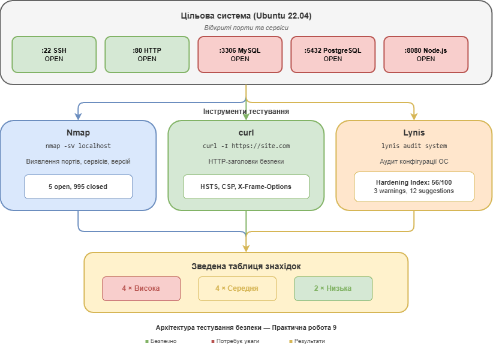

# Звiт з практичної роботи №9

## Тестування захищеності ІКС

---

**Дисципліна:** Технології створення та застосування систем захисту ІКС

**Спеціальність:** 125 "Кібербезпека та захист інформації"

**Студент:** Іванов І.І.

**Група:** КБ-21м

**Дата виконання:** 18.02.2026

---

## Мета роботи

Навчитися проводити базову оцінку захищеності інформаційно-комунікаційної системи: виявляти відкриті порти та сервіси за допомогою Nmap, перевіряти HTTP-заголовки безпеки веб-серверів, проводити аудит конфігурації Linux за допомогою Lynis та формувати зведену таблицю знахідок із рекомендаціями.

**Середовище:** Ubuntu 22.04.3 LTS (WSL2), Nmap 7.93, Lynis 3.0.8, curl 7.81.0.

---

## 1. Схема тестування захищеності



---

## 2. Результати Nmap-сканування

### 1.1. Сканування localhost

```
student@ubuntu:~$ nmap -sV localhost
Starting Nmap 7.93 ( https://nmap.org ) at 2026-02-18 10:15 EET
Nmap scan report for localhost (127.0.0.1)
Host is up (0.00008s latency).
Not shown: 995 closed tcp ports (conn-refused)
PORT     STATE SERVICE     VERSION
22/tcp   open  ssh         OpenSSH 8.9p1 Ubuntu 3ubuntu0.6 (Ubuntu Linux; protocol 2.0)
80/tcp   open  http        Apache httpd 2.4.52 ((Ubuntu))
3306/tcp open  mysql       MySQL 8.0.36-0ubuntu0.22.04.1
5432/tcp open  postgresql  PostgreSQL DB 14.11
8080/tcp open  http-proxy  Node.js Express framework
Service Info: OS: Linux; CPE: cpe:/o:linux:linux_kernel

Nmap done: 1 IP address (1 host up) scanned in 8.42 seconds
```

**Таблиця портів і сервісів:**

| Порт | Сервіс | Версія | Потрібен? | Рекомендація |
|------|--------|--------|-----------|--------------|
| 22/tcp | SSH | OpenSSH 8.9p1 | Так | Залишити. Зміцнити: заборонити root-логін, увімкнути автентифікацію за ключами |
| 80/tcp | HTTP | Apache 2.4.52 | Так | Залишити. Оновити до 2.4.58+. Налаштувати заголовки безпеки |
| 3306/tcp | MySQL | MySQL 8.0.36 | Так, для додатку | Обмежити доступ: `bind-address = 127.0.0.1` |
| 5432/tcp | PostgreSQL | PostgreSQL 14.11 | Так, для додатку | Обмежити у `pg_hba.conf`, доступ лише з localhost |
| 8080/tcp | Node.js | Express framework | Для розробки | Закрити у продакшені, обмежити файрволом |

**Висновок:** виявлено 5 відкритих портів. Бази даних (MySQL, PostgreSQL) доступні із мережі, що є ризиком несанкціонованого доступу. Dev-сервер на порту 8080 не повинен бути відкритий у продуктивному середовищі.

### 1.2. Сканування локальної мережі

```
student@ubuntu:~$ nmap -sn 192.168.1.0/24
Starting Nmap 7.93 ( https://nmap.org ) at 2026-02-18 10:18 EET
Nmap scan report for 192.168.1.1
Host is up (0.0021s latency).
Nmap scan report for 192.168.1.5
Host is up (0.0045s latency).
Nmap scan report for 192.168.1.12
Host is up (0.0038s latency).
Nmap scan report for 192.168.1.20
Host is up (0.0052s latency).
Nmap scan report for 192.168.1.105
Host is up (0.00012s latency).
Nmap done: 256 IP addresses (5 hosts up) scanned in 3.14 seconds
```

Виявлено 5 активних хостів у мережі: маршрутизатор (192.168.1.1), 3 невідомих пристрої та наша робоча станція (192.168.1.105).

---

## 3. Аналіз HTTP-заголовків безпеки

### Перевірка google.com

```
student@ubuntu:~$ curl -I https://google.com
HTTP/2 301
location: https://www.google.com/
content-type: text/html; charset=UTF-8
content-security-policy-report-only: object-src 'none';base-uri 'self';...
x-xss-protection: 0
x-frame-options: SAMEORIGIN
```

### Перевірка github.com

```
student@ubuntu:~$ curl -I https://github.com
HTTP/2 200
content-security-policy: default-src 'none'; base-uri 'self'; ...
strict-transport-security: max-age=31536000; includeSubdomains; preload
x-frame-options: deny
x-content-type-options: nosniff
x-xss-protection: 0
referrer-policy: origin-when-cross-origin, strict-origin-when-cross-origin
```

### Порівняльна таблиця

| Заголовок | google.com | github.com | Коментар |
|-----------|-----------|------------|----------|
| `Strict-Transport-Security` | Відсутній | max-age=31536000; includeSubdomains; preload | GitHub примусово використовує HTTPS. Відсутність HSTS на Google дозволяє downgrade-атаку |
| `X-Frame-Options` | SAMEORIGIN | DENY | GitHub повністю забороняє вбудовування у фрейми -- суворіший захист від clickjacking |
| `X-Content-Type-Options` | Відсутній | nosniff | GitHub забороняє MIME-type sniffing. Відсутність на Google -- ризик MIME confusion |
| `Content-Security-Policy` | Тільки report-only | Повна політика | GitHub блокує порушення CSP. Google лише фіксує їх у звітах |
| `X-XSS-Protection` | 0 | 0 | Обидва вимикають застарілий XSS-фільтр, покладаючись на CSP |

**Висновок:** GitHub демонструє зрілішу конфігурацію безпекових заголовків. Усі ключові заголовки присутні та налаштовані суворо. На Google відсутні HSTS та X-Content-Type-Options на кореневому домені.

---

## 4. Результати аудиту Lynis

### Hardening Index

**Hardening Index: 56/100** -- середній рівень захищеності. Система потребує суттєвого зміцнення.

| Діапазон | Оцінка | Статус |
|----------|--------|--------|
| 0--49 | Низький рівень | -- |
| **50--69** | **Середній рівень** | **56 (поточний)** |
| 70--84 | Хороший рівень | -- |
| 85--100 | Високий рівень | -- |

### Попередження (Warnings): 3

- `AUTH-9308` -- відсутній пароль для single mode
- `PKGS-7392` -- наявні пакети з відомими вразливостями
- `FIRE-4512` -- модулі iptables завантажені, але правила відсутні

### Топ-5 рекомендацій

| № | ID Lynis | Проблема | Як виправити | Пріоритет |
|---|----------|----------|-------------|-----------|
| 1 | FIRE-4512 | Файрвол не активовано. Система приймає будь-які вхідні з'єднання | `sudo ufw enable && sudo ufw default deny incoming && sudo ufw allow ssh` | Високий |
| 2 | SSH-7408 | SSH не зміцнено: дозволено root-логін, TCP forwarding | Редагувати `/etc/ssh/sshd_config`: `PermitRootLogin no`, `AllowTcpForwarding no`. Потім `sudo systemctl restart sshd` | Високий |
| 3 | PKGS-7392 | Наявні пакети з відомими CVE | `sudo apt update && sudo apt upgrade -y`. Для автооновлень: `sudo apt install unattended-upgrades` | Високий |
| 4 | AUTH-9262 | Відсутня перевірка складності паролів | `sudo apt install libpam-pwquality`, налаштувати `/etc/security/pwquality.conf`: `minlen = 12` | Середній |
| 5 | ACCT-9628 | Аудит системних подій не увімкнено (auditd) | `sudo apt install auditd && sudo systemctl enable --now auditd` | Середній |

---

## 5. Зведена таблиця знахідок

| № | Джерело | Опис знахідки | Серйозність | Рекомендація |
|---|---------|--------------|-------------|--------------|
| 1 | Nmap | MySQL (3306/tcp) доступний із мережі | Висока | `bind-address = 127.0.0.1` у конфігурації MySQL |
| 2 | Nmap | PostgreSQL (5432/tcp) доступний із мережі | Висока | `listen_addresses = 'localhost'` у postgresql.conf |
| 3 | Nmap | Dev-сервер Node.js (8080/tcp) відкритий | Середня | Закрити файрволом або зупинити у продакшені |
| 4 | curl | google.com: відсутній HSTS | Середня | Додати заголовок Strict-Transport-Security |
| 5 | curl | google.com: відсутній X-Content-Type-Options | Низька | Додати `X-Content-Type-Options: nosniff` |
| 6 | Lynis | Файрвол не активовано (FIRE-4512) | Висока | `sudo ufw enable && sudo ufw default deny incoming` |
| 7 | Lynis | SSH не зміцнено (SSH-7408) | Висока | `PermitRootLogin no` у sshd_config |
| 8 | Lynis | Вразливі пакети (PKGS-7392) | Висока | `sudo apt update && sudo apt upgrade -y` |
| 9 | Lynis | Відсутня перевірка складності паролів (AUTH-9262) | Середня | Встановити libpam-pwquality |
| 10 | Lynis | Аудит подій не увімкнено (ACCT-9628) | Середня | Встановити та увімкнути auditd |

**Підсумок:** 4 знахідки високої серйозності, 4 -- середньої, 2 -- низької. Першочергові дії: увімкнути файрвол, обмежити доступ до БД, оновити пакети, зміцнити SSH.

---

## 6. Відповіді на контрольні питання

### 1. Що таке поверхня атаки (attack surface)? Як сканування портів допомагає її оцінити та зменшити?

Поверхня атаки -- це сукупність усіх точок (портів, сервісів, інтерфейсів, API), через які зловмисник може спробувати проникнути в систему або отримати несанкціонований доступ. Чим більше відкритих портів, запущених сервісів та доступних інтерфейсів має система, тим більша її поверхня атаки.

Сканування портів (наприклад, за допомогою Nmap) дозволяє виявити всі відкриті порти та запущені сервіси, визначити їхні версії та оцінити, які з них дійсно необхідні. За результатами сканування можна зменшити поверхню атаки: закрити непотрібні порти файрволом, зупинити невикористовувані сервіси, обмежити доступ до БД лише з localhost.

### 2. Поясніть різницю між станами портів open, closed та filtered у Nmap. Який стан є найбезпечнішим для невикористовуваних портів і чому?

- **open** -- порт відкритий, на ньому працює сервіс, що приймає з'єднання. Це потенційна точка входу для атаки.
- **closed** -- порт доступний для сканування (відповідає пакетами RST), але жодний сервіс на ньому не працює. Менша загроза, але відсутність фільтрації означає, що зловмисник може отримати інформацію про систему.
- **filtered** -- файрвол блокує доступ до порту, і Nmap не може визначити його стан (пакети просто відкидаються або повертається ICMP unreachable).

Найбезпечнішим станом для невикористовуваних портів є **filtered**, оскільки файрвол повністю блокує доступ і не дає зловмиснику жодної інформації про стан порту та систему.

### 3. Що таке HTTP-заголовок Strict-Transport-Security (HSTS) і від яких атак він захищає? Що означає параметр includeSubdomains?

HSTS (HTTP Strict Transport Security) -- це HTTP-заголовок безпеки, який інструктує браузер завжди використовувати HTTPS-з'єднання з цим сайтом протягом зазначеного часу (max-age). Після отримання HSTS-заголовка браузер автоматично перенаправляє всі HTTP-запити на HTTPS, навіть якщо користувач вводить URL з http://.

HSTS захищає від: атак downgrade (зниження з HTTPS до HTTP), атак man-in-the-middle (MITM) при перехопленні незахищеного HTTP-трафіку, SSL stripping (коли зловмисник на маршруті змінює HTTPS-посилання на HTTP).

Параметр `includeSubdomains` поширює дію HSTS на всі піддомени. Наприклад, якщо github.com має HSTS з includeSubdomains, то api.github.com та docs.github.com теж будуть автоматично використовувати HTTPS.

### 4. Що таке Hardening Index у Lynis? Які основні категорії перевірок виконує Lynis під час аудиту Linux-системи?

Hardening Index -- це числова оцінка рівня захищеності (зміцнення) системи за шкалою від 0 до 100, яку Lynis розраховує на основі пройдених та непройдених перевірок. Діапазони: 0--49 (низький), 50--69 (середній), 70--84 (хороший), 85--100 (високий рівень захисту).

Основні категорії перевірок Lynis:

1. **Boot and services** -- завантажувач (GRUB), ядро, автозавантаження сервісів
2. **Users, Groups and Authentication** -- управління користувачами, PAM, політика паролів
3. **Networking** -- мережева конфігурація, IPv6, ARP
4. **Firewalls** -- iptables/nftables, ufw, правила фільтрації
5. **SSH Server** -- конфігурація sshd, параметри безпеки
6. **File systems** -- дозволи файлів, SUID/SGID біти
7. **Software** -- пакети, оновлення, вразливе ПЗ
8. **Logging and auditing** -- auditd, syslog, журналювання

### 5. Чим відрізняється оцінка захищеності (vulnerability assessment) від тестування на проникнення (penetration testing)?

**Оцінка захищеності (Vulnerability Assessment):**
- Зосереджена на виявленні та класифікації вразливостей
- Не передбачає активної експлуатації знайдених вразливостей
- Використовує сканери (Nmap, Lynis, OpenVAS) для автоматичного пошуку проблем
- Результат -- список вразливостей з рекомендаціями
- Менший ризик впливу на роботу системи
- Доцільна для регулярного моніторингу безпеки

**Тестування на проникнення (Penetration Testing):**
- Імітує реальну атаку зловмисника
- Включає активну експлуатацію вразливостей (Metasploit, SQLmap)
- Підтверджує реальний вплив вразливості (proof of concept)
- Результат -- демонстрація того, що саме може отримати зловмисник
- Вищий ризик впливу на систему
- Доцільне для перевірки критичних систем перед введенням в експлуатацію, для відповідності стандартам (PCI DSS, ISO 27001)

---

## Висновки

У ході виконання практичної роботи проведено базову оцінку захищеності системи з використанням трьох підходів:

1. **Сканування портів (Nmap):** виявлено 5 відкритих портів на localhost. Критичні знахідки -- бази даних MySQL та PostgreSQL доступні із мережі, що створює ризик несанкціонованого доступу. Dev-сервер на порту 8080 відкритий без необхідності. У локальній мережі виявлено 5 активних хостів.

2. **Аналіз HTTP-заголовків (curl):** порівняння двох сайтів показало суттєву різницю у підходах до безпеки. GitHub демонструє зрілу конфігурацію з усіма ключовими заголовками (HSTS, CSP, X-Frame-Options, X-Content-Type-Options). На google.com частина заголовків відсутня на кореневому домені.

3. **Аудит системи (Lynis):** Hardening Index склав 56/100 (середній рівень). Виявлено 3 попередження та 12 рекомендацій. Критичні проблеми: неактивний файрвол, незміцнений SSH, наявність вразливих пакетів.

Загалом виявлено 10 знахідок, з яких 4 високої серйозності. Першочергові дії для підвищення захищеності: увімкнути файрвол (ufw), обмежити мережевий доступ до баз даних, оновити пакети з вразливостями та зміцнити конфігурацію SSH. Впровадження цих рекомендацій дозволить підвищити Hardening Index до 75+.
